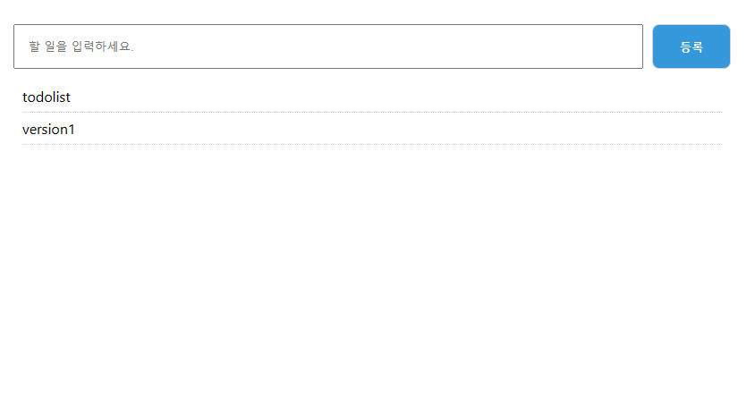

# TodoList-Web

👉[Youtube](https://www.youtube.com/watch?v=aV7SCTz5DgM&list=PLI33CnBTx2MZGD7zAQ810_B8dDU_E8gaq&index=20)

## ver1: basic version of todolist
    ☑ input form
    ☑ button click ⇒ insert new ul
    ☑ input form initialize

{: width="100%" height="100%"}

## ver2: upgrade version of ver1
    base: ver1 
    ☑

